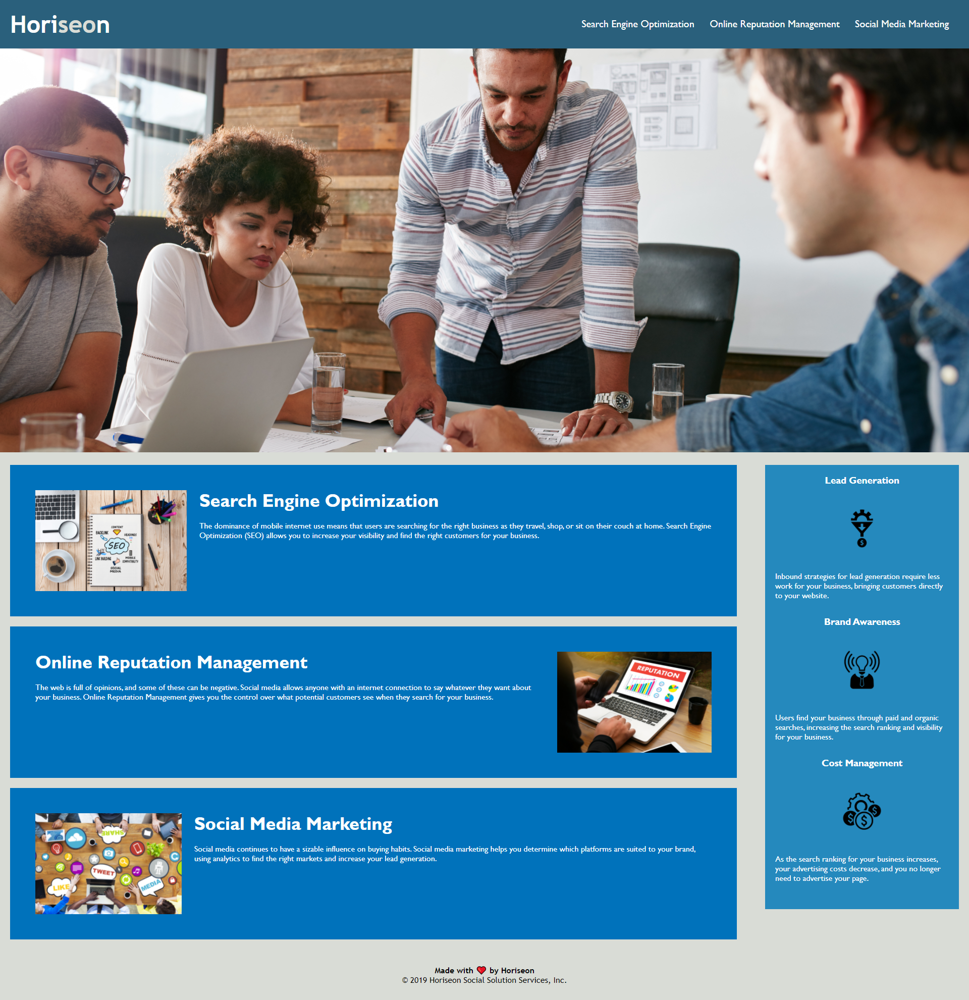

# Horiseon-code-refactor

Refactored an existent code from Horiseon Company to meet the accessibility requirements.

## Description

In this project I refactored an existent code for Horiseon's Marketing Agency landing page, by following the Scout rule. My job ticket required to increase the accessibility of the webpage in order to make it more accessible for assistive technologies. I improved the long-term sustainability of the code by increasing the efficiency of the CSS and using semantic HTML elements.

## Technical changes I made

### HTML

- gave a concise title to the webpage
- added semantic tag elements
- corrected self-closing tabs
- added alt attributes to image elements to improve accessibility
- added high-level comments to describe the structure of the webpage
- repaired links that weren't working
- rearranged heading elements in a sequential order

### CSS

- reduced duplication of style declaration by applying the class group property
- restructured the CSS elements declaration order to follow the structure of the HTML page
- added high-level comments

## Link to deployed application

Click [here]() to visit the deployed application on GitHub pages.

## Screenshot of the refactored webpage

